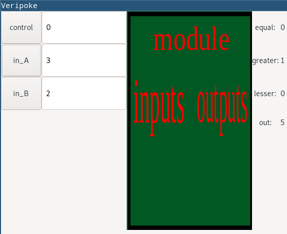

## About

This project is created to test a verilog module in an easy way, not by
 
suffering testbenches, instead with pretty graphical interface. something like 

"poke tool" in Logisim. I used 
[Verilator](https://www.veripool.org/wiki/verilator) 
to convert Verilog code to C++ code (systemC).

[Verilog::Netlist](https://metacpan.org/pod/Verilog::Netlist) 
is used to extract module ports names and attributes.

## Installation in Archlinux
Before running Makefile you need to install iverilog, gcc, perl, verilator and gtk3:

```
    sudo pacman -S gcc perl gtk3 iverilog verilator
    sudo cpan  Verilog::Netlist
```

Then use Makefile to compile and install:
```
    make
    make install
```

## Usage
I'd rather to explain usage with an example.
Consider you have a module name called ALU with following 

implementation in "alu.v" file :
```

module alu(
                input [63:0]
                in_A,
                in_B,
                input [2:0]
                control,
                output reg [63:0]
                out,
                output
                greater,
                lesser,
                equal);
        assign greater = (in_A > in_B) ? 1 : 0;
        assign equal = (in_A == in_B) ? 1 : 0;
        assign lesser = (!greater && !equal);

        always @(*) begin
                case (control)
                        // addition
                        3'b000: out <= in_A + in_B;
                        // subtraction
                        3'b001: out <= in_A - in_B;
                        // and
                        3'b010: out <= in_A && in_B;
                        // or
                        3'b011: out <= in_A || in_B;
                        // shift left
                        3'b100: out <= in_A <<< 1;
                        // shift right
                        3'b101: out <= in_A >>> 1;
                endcase
        end
endmodule

```
Now you need to create a testbench to test this module, but it take many time 

and it is suffering, but do not get upset there is way getting out of suffering 

testbenches and it is "veripoke".

Just use veripoke and it will do all things needed and bring up a graphical window 

for you to test your modules in decimal manner:
```
    veripoke alu.v
```
Now only run "alu" binary file:
```
    ./alu
```
And you will endup something like this:

